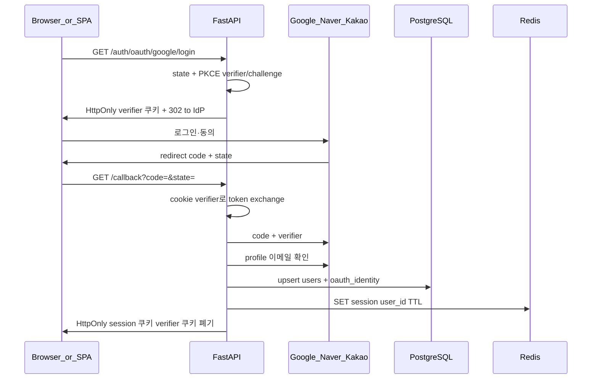

# STEP 1 — OAuth(Google/Naver/Kakao) + 사용자 저장 + Redis 세션

## 합의된 제품 정책 (심문 결과 반영)

- **가입/로그인**: 별도 register 폼 없음. **첫 OAuth 성공 시 `users` 생성**, 이후 같은 `(provider, provider_subject)`는 같은 user로 매핑 (**첫 로그인 = 가입**).
- **계정 병합**: Google vs Kakao 등 **제공자가 다르면 항상 별도 user** (이메일이 같아도 자동 병합 안 함).
- **이메일**: 가입 완료 조건으로 **반드시 필요**. 프로필에 이메일이 없으면 **거절 + 명확한 에러**(각 IdP 동의·스코프·앱 설정 필수, 특히 Kakao).
- **IdP 토큰**: Google/Naver/Kakao **액세스·리프레시 토큰은 DB에 저장하지 않음**. API 인증은 **Redis 서버 세션 + 세션 ID HttpOnly 쿠키**(STEP 메모의 JWT 문구와 다를 수 있음 — 구현 기준은 세션).
- **플로우**: **백엔드 콜백** + **PKCE** (`code_verifier`는 짧은 TTL **HttpOnly 쿠키** 등에 보관).
- **세션**: OAuth 콜백 성공 후 **Redis에 세션 레코드**(예: `user_id`, 필요 시 메타) 저장, 브라우저에는 **무작위 세션 ID**만 HttpOnly 쿠키로 저장·TTL 일치.
- **로그아웃**: **Redis에서 세션 키 삭제** + 브라우저 **세션 쿠키 제거**.
- **CSRF**: 쿠키 자동 전송에 대비해 **Origin 및 Referer 검증**(변경 메서드 등에 적용 범위를 구현 시 명시).
- **프론트·API 출처**: **동일 출처 프록시**(예: Vite `proxy`로 `/api` → 백엔드) 전제 — 교차 출처 `credentials` 조합은 STEP 1 범위에서 피함.

## 전체 그림

앱은 **OAuth로 신원 증명** 후, API 접근은 **Redis 세션**(브라우저는 세션 ID 쿠키만 보유)으로 통일합니다.



- **보호 라우트**: 세션 쿠키 → Redis 조회 → `user_id` 확보. 세션 없으면 401.

## 이메일 UNIQUE vs 제공자별 별도 계정 (**확정**)

[`db_table.sql`](/home/corestone/sources/image_labeling_tool/db_table.sql)에서 `users.email`은 UNIQUE NOT NULL이며, **제공자마다 별도 user**이므로 같은 표시 이메일로 두 번째 제공자 가입 시 충돌 가능함.

- **확정 정책**: 새 OAuth 유저 생성 전에 **해당 이메일이 이미 다른 user에 존재하면 가입 거절 HTTP 409** — 클라이언트 메시지: 다른 로그인 수단으로 이미 사용 중임을 안내.

## 레이어별 역할 (저장소 규칙과 맞추기)

워크스페이스 규칙상 **`api` → `services` → `repositories`** 단방향이 기준입니다. 현재 코드는 [`backend/app/domains/auth/`](/home/corestone/sources/image_labeling_tool/backend/app/domains/auth/) 스타일이므로, 실제 구현 시 둘 중 하나로 정하면 됩니다.

- **권장 정렬**: 새 코드를 `api/`, `services/`, `repositories/`로 두고 도메인 폴더는 점진 폐기, 또는
- **현실적 최소 변경**: `domains/auth` 안에서라도 **라우터 / 서비스 / 리포지토리 책임만** 지키기 (라우터에 비즈니스 로직 넣지 않음).

역할 분리 예시:

| 레이어 | 책임 |
|--------|------|
| Router | `provider` 검증, redirect URL 생성, 쿼리 파라미터 받기, 서비스 호출, 응답/리다이렉트 |
| Service | state/PKCE, code→token 교환, 프로필·**이메일 필수 검증**, user+oauth upsert, **Redis 세션 생성**, 세션·PKCE **HttpOnly 쿠키** 응답 구성 |
| Repository | `users`, `oauth_identities` 조회·삽입 |
| Core | 각 IdP 클라이언트 설정; **Redis URL·세션 TTL** |

외부 HTTP 호출(IdP 토큰·프로필)은 **서비스**에서 전담하거나, 작은 `OAuthClient` 헬퍼 클래스로 조합합니다.

## DB 구조 (users + OAuth 연동)

[`db_table.sql`](/home/corestone/sources/image_labeling_tool/db_table.sql) 현재:

```49:57:/home/corestone/sources/image_labeling_tool/db_table.sql
CREATE TABLE users (
  id BIGSERIAL PRIMARY KEY,

  email TEXT NOT NULL UNIQUE,

  password TEXT NOT NULL,

  created_at TIMESTAMP NOT NULL DEFAULT NOW()
);
```

OAuth만 쓰는 사용자는 비밀번호가 없으므로 **`password`를 NULL 허용**하거나, 컬럼명을 `password_hash`로 바꾸며 **NULL 허용**하는 쪽이 맞습니다. STEP 메모의 `password_hash`와도 일치시킬 수 있습니다.

**추가 테이블 `oauth_identities`(권장 이름 예시)** — `(provider, provider_subject)`마다 정확히 하나의 `user_id`. **현재 정책**: 제공자가 다르면 다른 user이므로 동일 인물의 여러 IdP를 한 user에 묶지 않음(나중에 “계정 연결”을 넣으면 그때 스키마·플로우 확장).

- `id`, `user_id` → `users(id)`
- `provider` — `google` | `naver` | `kakao` (PostgreSQL `ENUM` 또는 `TEXT` + CHECK)
- `provider_subject` — IdP가 주는 고유 사용자 ID (Google `sub`, Naver `id`, Kakao `id` 등)
- `created_at`
- **UNIQUE(`provider`, `provider_subject`)**

이메일은 `users.email`에 두며, **합의상 반드시 채워진 상태에서만 user 생성 완료**. 미제공 시 가입 실패 처리. **이미 다른 user가 동일 이메일을 쓰는 경우 HTTP 409 거절**(위 정책).

모든 변경은 **Alembic 마이그레이션**으로 버전 관리합니다.

## Google / Naver / Kakao 구현 관점

공통: **Authorization Code** 플로우, `state`(및 필요 시 PKCE)로 CSRF 방지.

| 제공자 | 특징 (구현 시 분기점) |
|--------|------------------------|
| Google | OIDC가 잘 정비되어 있음 → ID 토큰 또는 userinfo로 `sub`/email 수집이 단순 |
| Naver | OAuth 2.0 + 별도 프로필 API 호출 패턴이 일반적 (엔드포인트·응답 필드 매핑) |
| Kakao | OAuth 2.0 + 사용자 정보 API; 이메일은 **별도 동의·앱 설정**이 필요한 경우가 많음 |

설정은 환경변수로 분리하는 편이 좋습니다 (예: `OAUTH_GOOGLE_CLIENT_ID`, `…SECRET`, `…REDIRECT_URI`, 동일 패턴으로 `NAVER`, `KAKAO`).

라이브러리 선택은 팀 취향입니다. **Authlib** 등으로 Google OIDC를 붙이고, Naver/Kakao는 **등록된 authorize/token/userinfo URL** 로 OAuth2 클라이언트를 각각 등록하는 방식이 흔합니다.

## API 형태 (STEP 1 요구와 매핑)

STEP 메모의 `POST /auth/register`, `POST /auth/login`은 OAuth에서는 보통 다음처럼 바꿉니다.

- **`GET /auth/oauth/{provider}/login`** — 해당 IdP로 리다이렉트 (또는 SPA면 JSON으로 `authorization_url` 반환).
- **`GET /auth/oauth/{provider}/callback`** — code 처리 후 **Redis 세션 + 세션 HttpOnly 쿠키**, PKCE verifier 쿠키 폐기.
- **`GET /me`** — 세션에서 `user_id` 조회 후 반환.
- **`POST /auth/logout`** — Redis 세션 삭제 + `Set-Cookie` 만료.

프로젝트 관련 엔드포인트(`POST/GET /projects`)는 동일 **세션** 검증으로 보호.

## 동일 출처 프록시

개발·배포 시 브라우저 기준 **한 오리진**(예: `https://app.example.com`)만 두고, 정적/SPA와 `/api`가 같은 호스트로 보이게 프록시합니다. 세션 쿠키는 **`Path=/`(또는 `/api`)** 등 일관되게 두고 `Secure`/`SameSite`는 배포 환경에 맞게 설정.

## 쿠키·보안 메모

- **세션 쿠키**: HttpOnly, `Secure`(운영), `SameSite`는 동일 출처 프록시 전제에서 보통 `Lax`로 시작 가능.
- **CSRF**: **Origin / Referer** 허용 목록 검증(프록시 뒤 실제 호스트·포트와 맞출 것). GET OAuth 콜백 등 예외 경로는 제외 규칙 명시.
- **Redis**: Celery 브로커와 같은 인스턴스를 쓸 경우 **키 프리픽스**(예: `sess:`)로 분리.

## 현재 코드베이스와의 정리

- [`backend/app/main.py`](/home/corestone/sources/image_labeling_tool/backend/app/main.py)는 `api_router`를 import하지만 **`include_router`가 없고**, 로컬에 `app/api/` 트리가 보이지 않습니다. STEP 1 시작 시 **헬스·auth·projects 라우터 등록**까지 한 번에 맞추는 것이 좋습니다.

## 요약

- **구조**: IdP 인증(PKCE) → 콜백에서 프로필·**이메일 필수** → **`users` + `oauth_identities`** → **Redis 세션 + 세션 쿠키** → 보호 API는 세션 조회. IdP 액세스 토큰은 저장하지 않음.
- **스키마**: `password`(또는 `password_hash`) **NULL 허용** + **`oauth_identities`** 추가가 핵심.
- **세 제공자**: 같은 서비스/리포지토리 흐름 안에서 **provider별 설정·프로필 파서만 플러그인처럼 분리**하면 유지보수가 쉽습니다.
