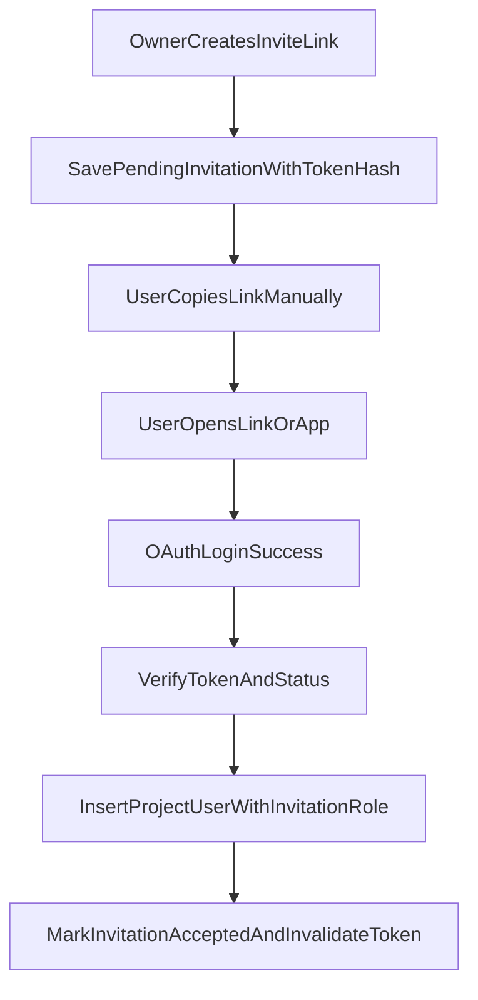

# STEP 1.1 프로젝트 / 초대 링크(수동 공유) 플로우

## 목표

- `POST /projects`: 프로젝트 생성 + 생성자를 `project_users(role=owner)`로 자동 추가.
- **초대는 이메일로 보내지 않음.** Owner가 `annotator` / `reviewer` 중 역할을 고른 뒤 **초대 URL(또는 토큰)을 생성**하고, UI에서 복사해 상대에게 직접 전달.
- 가입 전(링크 미사용·기한 내) 상태는 `project_invitations` 등 **토큰 테이블**, 가입 완료는 `project_users`.
- **프로젝트 목록 두 가지**
  1. **내가 owner인 프로젝트**  
     - 초대 링크 생성(annotator / reviewer만).  
     - 현재 멤버 목록 조회.
  2. **내가 `project_user`로만 포함된 프로젝트**  
     - 목록은 단순; 항목 클릭 시 프로젝트 기본 정보만 표시(MVP 범위).
- OAuth 로그인 이메일과 “초대 대상” 이메일을 맞출 필요 없음(이번 단계에서는 **이메일을 받지 않음**). 수락은 **유효한 토큰 + 로그인된 사용자**만으로 진행.

## 초대(테이블)가 이메일 없이도 필요한가?

**필요하다.** 이유는 단순하다.

- 클라이언트에 보이는 링크의 **토큰은 DB에 해시로만 저장**하고, 수락 시 검증해야 한다.
- **역할(annotator/reviewer)** 은 링크 생성 시점에 고정되어야 한다.
- **만료**, **1회 사용 후 무효**, (선택) **취소** 같은 상태를 서버가 알아야 한다.

즉 테이블 이름이 `project_invitations`이어도, 이번 스코프에서는 **“이메일 초대”가 아니라 “조인 링크(토큰) 발급 이력”**으로 쓰면 된다.

- `invited_email`: **이번 단계에서는 사용하지 않으면 `NULL` 허용 또는 컬럼 생략(마이그레이션으로 정리)** 해도 된다. 나중에 이메일 초대를 넣을 때 다시 추가 가능.

## 확정 정책

- **Role 결정 시점**: 링크(초대) 생성 시점에 고정(`annotator` / `reviewer`만; `owner`는 초대로 부여 불가).
- **수락 정책**: 토큰 유효성 + 로그인된 사용자만으로 수락(이메일 매칭 없음).
- **재사용 방지**: 해당 초대 행이 `accepted` 되면 토큰은 즉시 무효.
- **프로젝트 생성**: 트랜잭션 내 `projects` + `project_users(owner)` 동시 생성.
- **권한**
  - 초대 링크 생성: 해당 프로젝트의 **owner만**.
  - 멤버 목록 조회: **owner만**(MVP). (이후 reviewer에게도 일부 공개 여부는 별도 정책.)

## 스키마/마이그레이션

- Postgres ENUM `project_invitation_role AS ENUM ('annotator', 'reviewer')` → `project_invitations.role`.
- 멤버 역할은 기존 `project_role`(`owner` | `annotator` | `reviewer`) → `project_users.role`. 수락 시 invitation role을 동일 이름의 `project_role`로 매핑.
- 테이블 `project_invitations` (역할: 토큰 + 메타데이터).
  - 권장 컬럼: `id`, `project_id`, `role project_invitation_role NOT NULL`, `token_hash`, `status`(`pending`, `accepted`, `expired`, `cancelled`), `invited_by`, `accepted_by` NULL, `accepted_at` NULL, `expires_at`, `created_at`.
  - **`invited_email`**: 수동 링크만 쓸 경우 **NULL 허용** 또는 컬럼 없음.
  - FK: `project_id` → `projects(id)` ON DELETE CASCADE; `invited_by` → `users(id)`; `accepted_by` → `users(id)` ON DELETE SET NULL.
  - `UNIQUE(token_hash)`, `INDEX(project_id, status)`, `CHECK(expires_at > created_at)`.
- `docs/schema.dbml`, `db_table.sql`, Alembic 동일 PR에서 동기화.

## 백엔드 — 코드 enum 관리

- `ProjectRole` — owner, annotator, reviewer.
- `ProjectInvitationRole` — annotator, reviewer만.

## API 설계 (DTO 규칙 적용)

**프로젝트**

- `POST /projects` — 생성 + owner 멤버.
- `GET /projects/owned` — 현재 사용자가 **owner**인 프로젝트만 (초대 링크 생성·멤버 UI의 소스).
- `GET /projects/member` — 현재 사용자가 `project_users`에 있으나 **owner가 아닌** 프로젝트(또는 “내 멤버십 전체”에서 owned 제외한 집합; 명명은 구현 시 하나로 통일).
- `GET /projects/{project_id}` — 단순 정보(멤버/비멤버 접근 제어는 서비스에서 검증; 멤버는 최소 메타만).

**멤버(Owner)**

- `GET /projects/{project_id}/members` — owner만.

**초대 링크(Owner)**

- `POST /projects/{project_id}/invitations` — body: `role`만 (이메일 필드 없음). 응답에 **클라이언트가 붙여넣을 전체 URL 또는 raw token**(정책에 따라 하나만 노출).
- `POST /project-invitations/accept` — body: token; 수락 후 `project_users` 삽입 + invitation `accepted`.

모든 query/path/body는 Pydantic DTO로 분리.

## 수락 트랜잭션 핵심 흐름

## 무결성/예외 처리

- 이미 멤버인 사용자가 같은 초대를 수락하면 idempotent 처리.
- 만료/취소/이미 수락된 토큰 거절.
- 감사: `invited_by`, `accepted_by`, `accepted_at`.

## 테스트 계획

- 프로젝트 생성 시 owner 자동 생성.
- 초대 생성은 owner만; `owner` 역할 초대 거절.
- 1회 사용 보장, 만료 거절.
- `GET /projects/owned` vs `GET /projects/member` 집합 분리.
- 수락 후 `project_users` 반영.

## 구현 순서

1. 스키마 확정(`invited_email` nullable 여부 포함) → Alembic + `db_table.sql` + `schema.dbml`.
2. `projects` 도메인: 생성, owned/member 목록, 단건 조회.
3. owner 전용 멤버 목록 + 초대 링크 생성(이메일 없음).
4. 수락 API + 토큰 폐기.
5. 테스트.
