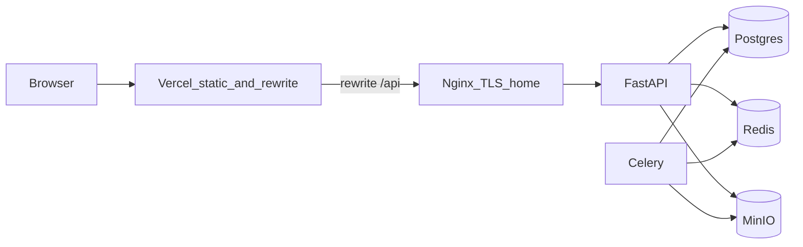

# Vercel 프론트 + 집 PC Docker 배포 (단계별)

## 현재 저장소 상태

- Compose: [docker-compose.dev.yml](docker-compose.dev.yml) — **Postgres / Redis / MinIO만** (앱·Celery·nginx 없음).
- 프론트: [frontend/package.json](frontend/package.json) — **Vite + React**.
- API 호출: [frontend/src/api/client.ts](frontend/src/api/client.ts)에서 `fetch(path, { credentials: 'include' })`, 경로는 대부분 **`/api/...` 상대 경로**.
- 로컬 개발: [frontend/vite.config.ts](frontend/vite.config.ts)에서 `server.proxy['/api']` → `http://127.0.0.1:8000`.

즉, **프론트는 “같은 출처에서 `/api`로 친다”**는 가정이 깔려 있어, Vercel에만 올리면 빌드 산출물만으론 프록시가 없어 **API에 못 붙는다** (리라이트/베이스 URL/도메인 설계가 필요).

---

## 1. Vercel에 프론트 “올리는” 방법 (GitHub)

1. [vercel.com](https://vercel.com)에서 GitHub 저장소 **Import**.
2. **Root Directory** 를 `frontend` 로 설정.
3. **Framework**: Vite (자동이면 그대로).
4. **Build**: `yarn install && yarn build` 또는 `npm ci && npm run build` (저장소에 맞게).
5. **Output**: Vite 기본 `frontend/dist` (Vercel이 Vite면 자동 인식).
6. **환경 변수**: 지금은 코드에 `VITE_` 베이스 URL이 없고 `/api` 고정이므로, 우선 **아래 2절 리라이트**로 해결하는 편이 자연스럽다 (`VITE_API_URL` 도입은 리라이트 대신 **CORS + 절대 URL**로 갈 때 검토).

**“CI/CD” 의미**: Vercel을 GitHub에 연결하면 **브랜치에 push할 때마다 빌드·배포**가 돌아간다. 별도 GitHub Actions **배포 워크플로가 필수는 아니다**. 다만 저장소 전체에 **lint/test** 를 강제하려면 `.github/workflows/ci.yml` 로 `frontend` (및 나중에 `backend`) 검증을 추가하는 건 권장된다.

---

## 2. 프로덕션에서 `/api`를 맞추는 두 갈래 (중요)

**권장 시작안 — Vercel 리라이트(역프록시)**  
저장소 루트 또는 `frontend`에 `vercel.json` 으로 예시:

```json
{
  "rewrites": [
    { "source": "/api/(.*)", "destination": "https://api.your-domain.example/$1" }
  ]
}
```

- 브라우저는 여전히 `https://xxx.vercel.app/api/...` 로 요청 → Vercel이 백엔드로 넘김 → **same-origin에 가까운 동작**을 노릴 수 있다.
- **주의**: OAuth 리다이렉트·`Set-Cookie` **Domain / SameSite / Secure** 가 IdP 설정·백엔드 세션 설정과 맞는지 **실제 로그인 플로로 검증**해야 한다. 공통 상위 도메인(예: `app.` / `api.` under 같은 `example.com`)을 쓰면 쿠키 정책이 단순해지는 경우가 많다.

**대안 — 절대 URL + CORS**  
`VITE_API_BASE=https://api.example.com` 로 바꾸고 fetch 전부 절대 경로, 백엔드는 CORS에 Vercel 출처 허용 + `credentials` 쓰면 `Access-Control-Allow-Credentials` 등. 이 경우 **코드 변경 + FastAPI CORS/쿠키** 정렬이 필요하다.

플랜 실행 시에는 **리라이트 먼저** 시도하고, 세션/OAuth 이슈가 있으면 도메인·쿠키 또는 CORS 쪽으로 조정하는 순서가 일반적이다.

---

## 3. 집 PC용 Compose: 프론트 제외한 파일이 맞는가?

**예.** Vercel이 UI를 호스팅하면 PC에서는 보통 다음만 Compose로 묶는다:

- `postgres`, `redis`, `minio` (이미 [docker-compose.dev.yml](docker-compose.dev.yml) 패턴 참고)
- `api` (FastAPI 이미지 또는 빌드)
- `celery` (worker; Redis와 같은 네트워크)
- 선택: **한 컨테이너 nginx** 또는 호스트 nginx — TLS 종료 + `api.` 만 외부에 노출

이름은 예를 들어 `docker-compose.prod.yml` 또는 `docker-compose.home.yml` 로 dev와 분리하는 게 관례적이다. **내용은 dev와 겹치되**, 포트 노출( DB/Redis/MinIO는 외부 바인딩 최소화), 비밀·볼륨·재시작 정책을 프로덕션용으로 바꾼다.

프론트를 **집에서도** nginx로 같이 서빙할 거면 그때만 정적 파일 서비스를 추가하면 된다 (Vercel 쓸 때는 불필요).

---

## 4. CI/CD “필요하냐?” 에 대한 짧은 답

| 구분 | 필수냐 | 설명 |
|------|--------|------|
| **Vercel ↔ GitHub** | 프론트 자동 배포에 사실상 충분 | 연결만 하면 CD 역할 함 |
| **GitHub Actions (test/lint)** | 강력 권장, 초기엔 선택 | 깨진 코드가 Vercel까지 올라가는 것 방지 |
| **집 서버 배포 자동화** | 선택 | `ssh` + `compose pull && up -d` 또는 이전에 논의한 main 머지 배포 |

**처음 한 사이클**: **Vercel 자동 배포 + (선택) Actions로 프론트 빌드/린트** → 집 PC는 **수동 compose**로 안정화 → 그 다음 SSH 배포 자동화.

---

## 5. 데이터 흐름 (요약 다이어그램)



---

## 6. 구현 시 권장 순서 (저장소 작업 관점)

1. `vercel.json` + Vercel 프로젝트 설정(Root=`frontend`).
2. 집 PC용 compose 초안 (기존 dev 서비스 + api + celery + nginx; `.env` 시크릿).
3. 공개 API URL(`https://api....`)과 Vercel 리라이트 destination 일치 확인.
4. 로그인·`/api/me`·쿠키가 끝까지 동작하는지 확인 후 OAuth redirect URI 정리.
5. 여유 있으면 `.github/workflows/ci.yml` 에 `frontend` lint/build 추가.

이 순서가 “하나하나 해보기”에 맞는 최소 경로다.
